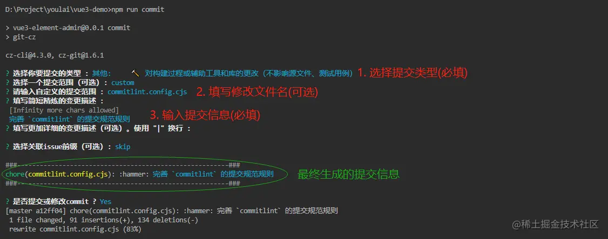

# screen-template

可视化大屏模板：基于Vu3+typescript+Vite

## 开发环境和工具

1. node v20.12.2
2. pnpm v8.7.0
3. vscode
4. vscode插件：EditorConfig for VS Code(EditorConfig 使项目代码风格在不同开发人员编辑器中保持一致)
5. vscode插件：ESLint(ESLint 是一个用于检测 JavaScript 代码问题的工具)
6. vscode插件：Prettier(Prettier 是一个代码格式化工具，可以自动格式化代码，使其符合统一的风格)

## 项目目录

## 项目模板启动和打包

1. npm install
2. npm run dev
3. npm run build

## 代码规范

### ESLint + Prettier

ESLint 与 Prettier 通常是一起使用的，前者只负责检测修复语法规则，后者负责代码格式化。

### stylelint

stylelint 是一个 CSS 语法检查工具，可以检测 CSS 代码的错误和风格问题。

### husky

husky 是一个 Git 钩子工具，可以自动检测到代码提交时修改的文件，然后执行相应的检查命令。

### lint-staged

lint-staged 是一个 Git 钩子工具，可以自动检测到代码提交时修改的文件，然后执行相应的检查命令。

### 格式化命令

```text
pnpm lint:eslint
pnpm lint:format
pnpm lint:stylelint
```

## 全自动提交代码

```text
pnpm commit
// 或者
npm run commit
```

cz-git 是一个 Git 提交信息规范工具，可以自动生成符合规范格式的提交信息。


### 手动 git 提交要规范

如：git commit -m "feat: 新增功能"

```shell
	'feat', // 新增功能
	'fix', // 修复缺陷
	'docs', // 文档变更
	'style', // 代码格式（不影响功能，例如空格、分号等格式修正）
	'refactor', // 代码重构（不包括 bug 修复、功能新增）
	'perf', // 性能优化
	'test', // 添加疏漏测试或已有测试改动
	'build', // 构建流程、外部依赖变更（如升级 npm 包、修改 webpack 配置等）
	'ci', // 修改 CI 配置、脚本
	'revert', // 回滚 commit
	'chore', // 对构建过程或辅助工具和库的更改（不影响源文件、测试用例）
```
